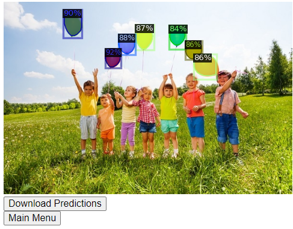

# Detectron2 REST API

## Preamble

The aim of this project is to use Deep Learning  

This project is organized in two parts, first contains code to fine-tune some computer vision models on a custom dataset and to serve a trained model with a REST API built with Flask. The dataset used for this project is the [well known balloon dataset](https://github.com/matterport/Mask_RCNN/releases)

## Introduction to Object Instance Segmentation

In image classification problems, there is usually a single object of interest. For that specific object, we build models to predict whether that object belongs to a specific class. For example, given a picture of an animal, the model should tell you whether it is a cat or a dog.

However, the real world is much more complex. What if there are cats and dogs in the image? What if we need to exactly know where the dogs are and where the cats are? What if they are overlapping, having a dog walking in front of a cat?

Image segmentation techniques allow us to detect multiple objects, classify them separately and localize them within a single image.

**To start with, a good introduction read is:
[A Brief History of CNNs in Image Segmentation: From R-CNN to Mask R-CNN](https://blog.athelas.com/a-brief-history-of-cnns-in-image-segmentation-from-r-cnn-to-mask-r-cnn-34ea83205de4)**

## The Computer Vision part : Mask R-CNN model

### Retrain the model

Let's build our first model! We recommend you to read [the paper](https://arxiv.org/pdf/1703.06870.pdf) and [this article](https://engineering.matterport.com/splash-of-color-instance-segmentation-with-mask-r-cnn-and-tensorflow-7c761e238b46) to understand more in-depth how Mask R-CNN works. If you aren't familiar with this type of models, we highly recommend you to look at the [optional exploration task](#optional-exploration-task).

To build our new model we need a dataset first. So, find a new dataset or create your own to train a new model.

Here are some ideas:

* Your friend who is a poor soul working in a bio lab complains how tedious it is to analyze cells. You help her by building a model that can automatically [detect the nucleus](https://colab.research.google.com/github/navidyou/Mask-RCNN-implementation-for-cell-nucleus-detection-executable-on-google-colab-/blob/master/mask_RCNN_cell_nucleus_google_colab.ipynb#scrollTo=jBONWUhASZIO).
* You keep on finding dog poop in your neighborhood. You are in rage and want to monitor every single dog passing by. So, you build [a model to detect dogs](https://hackernoon.com/instance-segmentation-in-google-colab-with-custom-dataset-b3099ac23f35).
* You are crazy about Frisbee, so you want a model to find Frisbee discs in a given image. For this, you can go to the [COCO dataset](http://cocodataset.org/#explore) and specifically pick frisbee images.

Please commit your code to this repo and document the process of using/creating a dataset to build a new model. Give a brief evaluation on how your model's performance and commit some sample results your model produced.

---

### Task 3. Modify the network

Most Mask R-CNN model uses `resnet101` as a backbone, which is a humongous model. According to the original paper, the inference time is lower bounded at 200ms which is very slow.

You have read that MobileNet [is extremely fast, while still remarkably accurate](https://hackernoon.com/creating-insanely-fast-image-classifiers-with-mobilenet-in-tensorflow-f030ce0a2991). Now, you really want to try it out.

The task is to use MobileNet with Mask R-CNN. Compare the performance briefly, what did you notice? Commit your code and document your process.

## The AI API : Build a simple REST API using flask

### Task 2. Build a simple AI API

Now you have a model. The world can't wait to use your new Mask R-CNN model! But how can the world interface with your model? You need an API!

Build a simple REST API with `flask` or another framework of your choice. An API user should be able to post an image to your API and receive the image with drawn mask and the percentage between masks and unmasked pixels.

You have free control over the design of your API. Please note there are multiple correct ways to do this.

We will run your API for testing. So, make sure you document how we can run your API **without the need to do the model training**.

---

