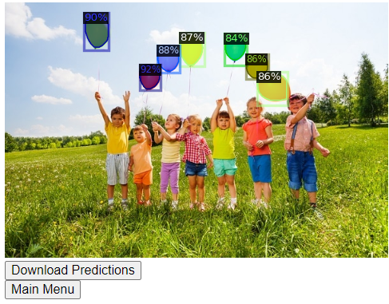

# Detectron2 REST API

The aim of this project is ...

## Preamble

This project is organized in two folders : 

- The `MaskRCNN_finetune` folder contains all the Deep Learning related code. Specifically, it contains code to download and extract the [well known balloon dataset](https://github.com/matterport/Mask_RCNN/releases), it also contains code to extend Detectron2 with new models... and to fine-tune them on ... 

- The `REST_API_flask` contains the code to serve the trained model with an API built with flask.

This assesment is designed to run on Google Colab but should be reproducible without (too much) hassle on any linux machine with a cuda enabled device.

## The Computer Vision part : Mask R-CNN model

In image classification problems, there is usually a single object of interest. For that specific object, we build models to predict whether that object belongs to a specific class. For example, given a picture of an animal, the model should tell you whether it is a cat or a dog.

However, the real world is much more complex. What if there are cats and dogs in the image? What if we need to exactly know where the dogs are and where the cats are? What if they are overlapping, having a dog walking in front of a cat?

Image segmentation techniques such as [Mask R CNN](https://arxiv.org/pdf/1703.06870.pdf) allow us to detect multiple objects, classify them separately and localize them within a single image. 

**To start with, a good introduction read is:
[A Brief History of CNNs in Image Segmentation: From R-CNN to Mask R-CNN](https://blog.athelas.com/a-brief-history-of-cnns-in-image-segmentation-from-r-cnn-to-mask-r-cnn-34ea83205de4)**

### Retrain the model

Most Mask R-CNN model uses `resnet101` as a backbone, which is a humongous model. According to the original paper, the inference time is lower bounded at 200ms which is very slow.

## The AI API : Build a simple REST API using flask

The REST API uses ngrok and flask and is pretty straight forward in its current state :

1. Download and instantiate the model when the API is launched the first time
2. Upload a local image

3. Run inference
   1. Predicted masks are displayed in the browser
   2. Predicted masks can be downloaded by the user

## Trained Models and Results

- Final trained weights for each model are available [here](https://www.dropbox.com/sh/yyqecdmbd7howkq/AADxOHGQQXtk7Jn8nIrTpG0Ha?dl=0) : 
  - ResNet-50-FPN : https://www.dropbox.com/s/we9n6mr1uyxlqt9/ResNet_50_FPN_model_final.pth?dl=1
  - ResNet-101-FPN : https://www.dropbox.com/s/7xtyuitiembeu79/ResNet101_FPN_model_final.pth?dl=1
  - MobileNetV2-FPN : https://www.dropbox.com/s/5ndg2gl153nap2x/MobileNetV2_FPN_model_final.pth?dl=1
  - VoVNet-FPN : https://www.dropbox.com/s/01879hbpditrv13/VoVNet_lite_FPN_model_final.pth?dl=1

| Model           | Inference Time   |  AP50 (Val) | AP50 (Test) |
|-----------------|------------------|-------------|-------------|
| ResNet-50-FPN   | 134 ms  | 90          | 84          |
| ResNet-101-FPN  | 179 ms  | 95          | 88          |
| MobileNetV2-FPN | 98.3 ms | 95          | 62          |
| VoVNet-19-FPN   | 95.6 ms | 90          | 85          |

*Nb : Download links for each model can be used directly as a config entry or as a script argument, those links are provided in the inference_config.*
